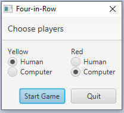

= JavaFX-приложения с графическим интерфейсом

Сегодня мы поговорим о приложениях, созданных с помощью библиотеки JavaFX. Эта библиотека появилась в 2007 году, она предназначена для проектирования приложений с графическим интерфейсом -- как Desktop-приложений (работающих на обычном компьютере), так и Web-приложений (работающих в браузере). Библиотека была призвана заменить GUI-библиотеку предыдущего поколения -- Swing. 

Первые годы JavaFX существовала отдельно от основной платформы Java, и язык для её программирования назывался JavaFX Script. В 2014 году библиотека вошла в состав JDK 1.8 и получила полноценную поддержку со стороны языка Java. В 2018 году при выпуске JDK 11 JavaFX убрали из состава JDK и выделили в https://gluonhq.com/products/javafx/[отдельную библиотеку].

== Поддержка на Java и Kotlin

Библиотека JavaFX входит в состав JDK 1.8, 9 и 10, поэтому для этих JDK программы на Java и Kotlin могут, в принципе, использовать её без подключения дополнительных зависимостей. При использовании JDK 11 и более поздней необходимо явное подключение JavaFX в виде https://gluonhq.com/products/javafx/[загруженного пакета], https://openjfx.io/openjfx-docs/#maven[Maven-зависимости] или https://openjfx.io/openjfx-docs/#gradle[Gradle-зависимости]. Данный проект пока использует JDK 1.8, поэтому JavaFX-зависимость доступна ему непосредственно; загрузить JDK 1.8 можно https://www.oracle.com/java/technologies/javase-jdk8-downloads.html[отсюда].

Для программ на Kotlin существует удобный DSL (Domain Specific Language = предметно-ориентированный язык) https://tornadofx.io[tornadofx] -- см. также https://github.com/edvin/tornadofx[его GitHub-репозиторий]. Этот DSL может быть подключен к программам на Kotlin как дополнительная библиотека -- подробности о подключении дополнительных библиотек см. в https://github.com/Kotlin-Polytech/FromKotlinToJava/tree/master/tutorial/07_Console_Exceptions.adoc[7-м разделе]; опять-таки можно использовать Maven- или Gradle-зависомость, примеры есть https://github.com/edvin/tornadofx[на GitHub в README].

Domain Specific Language позволяет, в частности, описывать структуру JavaFX-сцен в более прозрачной для программиста форме. Вот так, например, выглядит типичное описание диалога с помощью tornadofx (пример взят из https://github.com/Kotlin-Polytech/FromKotlinToJava/blob/master/src/part3/fourinrow/javafx/ChoosePlayerDialog.kt[игры 4 в ряд]).

[source,kotlin]
----
    init {
        title = "Four-in-Row"
        with (dialogPane) {
            headerText = "Choose players"
            buttonTypes.add(ButtonType("Start Game", ButtonBar.ButtonData.OK_DONE))
            buttonTypes.add(ButtonType("Quit", ButtonBar.ButtonData.CANCEL_CLOSE))
            content = hbox {
                vbox {
                    label("Yellow")
                    togglegroup {
                        bind(yellowPlayer)
                        radiobutton("Human") {
                            isSelected = true
                        }
                        radiobutton("Computer")
                    }
                }
                spacer(Priority.ALWAYS)
                vbox {
                    label("Red")
                    togglegroup {
                        bind(redPlayer)
                        radiobutton("Human")
                        radiobutton("Computer") {
                            isSelected = true
                        }
                    }
                }
            }
        }
    }
----

Прочитав этот фрагмент кода, мы можем узнать:

* Диалог называется Choose Players
* Диалог имеет две кнопки, позволяющие его покинуть -- Start Game(OK) и Quit(CANCEL)
* Основная часть диалога -- горизонтальная секция (hbox == horizontal box), состоящая, в свою очередь, из двух вертикальных секций (vbox == vertical box)
* Левая вертикальная секция помечена (label) как Yellow и включает в себя группу из двух радио-кнопок (radiobutton) -- из этих кнопок пользователь всегда сможет выбрать только одну. По умолчанию из кнопок Human и Computer выбрана Human
* Правая вертикальная секция помечена как Red и включает в себя две такие же кнопки, но по умолчанию выбрана Computer

== Простое приложение на JavaFX

Как подробно написано в https://www.tutorialspoint.com/javafx/javafx_application.htm[этой статье], JavaFX-приложение стоит на трёх основных китах:

* Stage = Окно приложения
* Scene = Сцена, содержимое окна, описывается графом сцены (Scene Graph)
* Nodes = Отдельные узлы графа сцены

Узлы JaxaFX имеют сложную иерархию. В рамках графа сцены всегда есть корневой узел (root), включающий в себя другие узлы (потомки), которые, в свою очередь, тоже могут иметь потомков, и так до любого уровня вложенности, то есть узлы образуют *дерево*. Кроме этого, отдельные типы узлов образуют иерархию наследования. Например:

* Parent = подвид узла, который может иметь потомков
* Group = подвид Parent, простая обёртка над одним или несколькими другими узлами
* Region = подвид Parent, описывающий *графический компонент* -- элемент графического интерфейса, видимый пользователю и дающий возможность делать с ним какие-то действия. 
* Control = подвид Region, описывающий обычный компонент, не содержащий внутри себя других компонентов. Примером являются Button, ListView, ScrollBar и другие.
* Pane = подвид Region, описывающий панель, состоящую из других упорядоченных компонентов. Примером являются BorderPane, DialogPane, HBox, VBox
* Shape = подвид узла, описывающий разные виды геометрических фигур -- этот элемент интерфейса просто изображается на экране, не предоставляя возможности с ним взаимодействовать. Примером фигур являются Circle, Line, Polygon, Rectangle, Text

Для того, чтобы создать JavaFX-приложение, необходим класс, расширяющий `javafx.application.Application`. Логика создания главного окна задаётся в его методе `start`, будущее окно `Stage` передаётся ему как параметр `primaryStage`. Необходимо, как минимум:

* Создать корневой элемент сцены
* Создать сцену на основе этого элемента и связать её с окном
* Задать заголовок окна
* Показать окно, вызвав его функцию `show`

Все эти действия выполнены ниже, см. также https://github.com/Kotlin-Polytech/FromKotlinToJava/blob/master/src/part3/simple/hello/javafx/HelloJavafx.java[пример].

[source,java]
----
public class HelloJavafx extends Application { 
    @Override     
    public void start(Stage primaryStage) {
        // Создаём корневой элемент сцены
        Group root = new Group(); 
        // Создаём сцену и задаём её размеры
        Scene scene = new Scene(root, 400, 300); 
        // Связываем сцену и окно
        primaryStage.setScene(scene);         
        // Задаём заголовок окну
        primaryStage.setTitle("Hello, JavaFX");     
        // Показываем окно
        primaryStage.show(); 
    }    
    public static void main(String[] args) {          
        // Запускаем JavaFX-приложение
        launch(args);     
    }         
} 
----

== Простое приложение на tornadofx

[source,kotlin]
----
class HelloView : View("Hello JavaFX") {
    override val root = BorderPane()
}

class HelloApp : App(HelloView::class)

fun main(args: Array<String>) {
    Application.launch(HelloApp::class.java, *args)
}
----

Как видно из https://github.com/Kotlin-Polytech/FromKotlinToJava/blob/master/src/part3/simple/hello/javafx/Main.kt[примера выше], tornadofx добавляет к "китам" JavaFX ещё несколько понятий:

* App -- простая обёртка над JavaFX-приложением, его метод `start(Stage)` выполняет примерно те действия, которые мы воспроизвели выше (в примере для "чистого" JavaFX) при создании главного окна приложения
* View -- представление, объединяющее в себе главное окно и его сцену

Для реализации простого tornadofx-приложения нам нужно написать *два* класса -- наследник `View`, в котором обязательно переопределить корневой узел сцены `root` и задать заголовок `View("Hello JavaFX")`, и наследник `App`, который через reflection -- см. `App(HelloView::class)` связывает приложение и представление. Главная функция запускает приложение через `Application.launch`, опять-таки используя reflection. 

== Архитектура GUI-приложений

Когда мы разрабатываем GUI-приложение (GUI = Graphical User Interface), важной задачей является отделение внутренней логики приложения от его графической части. Применительно к языкам Java и Kotlin удобно, например, поместить внутреннюю логику в отдельный пакет и полностью абстрагировать её от графической части -- например, не применять классы и функции из пакетов `javafx` и `tornadofx` и их подпакетов. Это позволяет, в частности:

* разрабатывать и тестировать внутреннюю логику приложения отдельно от его графических функций
* менять графическую часть приложения (в том числе, используемую библиотеку) без значительного изменения внутренней логики

Общеизвестным *шаблоном* (pattern), реализующим подобную архитектуру, является https://ru.wikipedia.org/wiki/Model-View-Controller[MVC] = Model-View-Controller (модель-представление-контроллер). В этом шаблоне приложение предполагается делить даже не на две, а на три части:

* Модель описывает внутреннюю логику, используется и тестируется через её API
* Представление описывает, как информация из модели представляется пользователю -- для JavaFX-приложения это совокупность сцен и диалогов
* Контроллер описывает, как приложение реагирует на команды пользователю -- для JavaFX-приложения это совокупность слушателей

В соответствии с изображением ниже, контроллер изменяет модель, а представление обновляется в соответствии с моделью. При этом пользователь видит представление и использует контроллер для управления приложением.

image::https://upload.wikimedia.org/wikipedia/commons/thumb/f/fd/MVC-Process.png/240px-MVC-Process.png[MVC]

== Пример: игра "4 в ряд"

С исходным кодом данного примера вы можете познакомиться https://github.com/Kotlin-Polytech/FromKotlinToJava/tree/master/src/part3/fourinrow[здесь]. Это реализация известной https://ru.wikipedia.org/wiki/%D0%A7%D0%B5%D1%82%D1%8B%D1%80%D0%B5_%D0%B2_%D1%80%D1%8F%D0%B4[логической игры]. Фактически это слегка модифицированные крестики-нолики на поле 7х6, в которых нужно составить в ряд четыре своих фишки, а сами фишки не ставятся на поле непосредственно, а закидываются туда сверху и падают в нижний свободный ряд. Подробнее см. https://ru.wikipedia.org/wiki/%D0%A7%D0%B5%D1%82%D1%8B%D1%80%D0%B5_%D0%B2_%D1%80%D1%8F%D0%B4[по ссылке].

Реализация игры иллюстрирует, в частности, архитектуру модель-представление, с этой целью классы разбиты на следующие пакеты:

* core -- модель, не зависящая от конкретного представления
* console, swing, javafx -- три разных видов представления, позволяющие игре работать соответственно в консоли, под библиотекой Swing и под tornadofx (нас интересует в первую очередь последнее представление)
* controller -- независимая от представления часть контроллера

Модель содержит простые классы, напрямую проецирующиеся на правила игры -- клетка `Cell`, фишка `Chip`, игровое поле `Board`. Класс "игровое поле" позволяет, в частности, добавлять фишки на доску `makeTurn` и определять победителя `winner`. Я не останавливаюсь на этих классах подробно, так как их реализация не очень относится к теме сегодняшнего рассказа.

Некоторые возможности JavaFX и tornadofx проиллюстрированы в пакете https://github.com/Kotlin-Polytech/FromKotlinToJava/tree/master/src/part3/fourinrow/javafx[javafx]. Он содержит классы `FourInRowApp`, `ChoosePlayerDialog` и `FourInRowView`. Поговорим о них подробнее.

== Построитель сцен

Многие графические библиотеки позволяют, как иногда говорят, "писать программы мышкой". Под этим обычно имеют в виду возможность создания графических интерфейсов в редакторе, подобном Paint. Такой редактор включает в себя палитру компонентов и возможность редактировать их различные свойства. Результатом работы редактора, как правило, является описание интерфейса во внутреннем формате (часто с этой целью используется XML-формат) и/или готовый код на языке программирования, создающий нарисованный графический интерфейс.

В библиотеке JavaFX с этой целью используется инструмент под названием JavaFX Scene Builder, скачать его можно https://gluonhq.com/products/scene-builder[отсюда]. Построитель сцен (после установки) интегрируется со всеми основными Java IDE, в частности, с https://docs.oracle.com/javafx/scenebuilder/1/use_java_ides/sb-with-intellij.htm[Intellij IDEA] и с https://docs.oracle.com/javafx/2/get_started/fxml_tutorial.htm[NetBeans IDE]. Результатом работы построителя сцен является FXML-файл, код для его использования в программе выглядит примерно так (пример взят с сайта Oracle).

[source,java]
----
@Override
public void start(Stage stage) throws Exception {
    Parent root = FXMLLoader.load(getClass().getResource("some.fxml"));
    Scene scene = new Scene(root, 400, 300);
    stage.setTitle("Welcome to FXML!");
    stage.setScene(scene);
    stage.show();
}
----

== Дополнительное чтение

* https://openjfx.io/openjfx-docs/[Getting started with JavaFX]
* https://www.jetbrains.com/help/idea/javafx.html[IDEA: Create a new JavaFX project]
* https://www.tutorialspoint.com/javafx/javafx_application.htm[Tutorials' Point: JavaFX Application]
* https://docs.oracle.com/javafx/2/scenegraph/jfxpub-scenegraph.htm[Oracle: Working with the JavaFX Scene Graph]
* https://docs.oracle.com/javase/8/javafx/properties-binding-tutorial/binding.htm[Oracle: Using JavaFX Properties and Binding]

